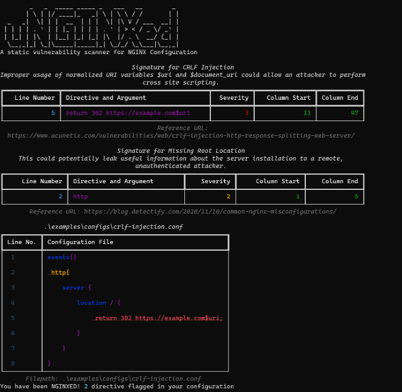
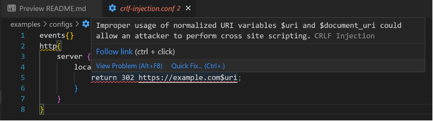
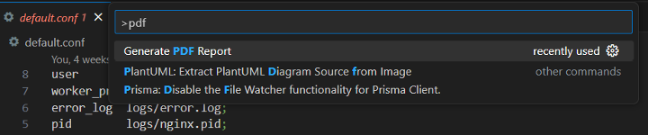

# uNGINXed

A tool that generates reports about misconfigurations in specified NGINX configuration files.

The reports may be in JSON format or PDF.


## Installation Guide

The uNGINXed project relies on Poetry to manage Python dependencies. It is highly encouraged to perform all uNGINXed operations within Poetry's environment.

Follow [Poetry installation Guide](https://python-poetry.org/docs/)

Installing uNGINXed Dependencies
```
poetry install
```
<div style="page-break-after: always;"></div>


## unNGINXed Usage

The uNGINXed engine support scanning of NGINX configurations from the command line.

Command Line Report
```
poetry run python -m unginxed <NGINX Configuration Path> -sv
```



<div style="page-break-after: always;"></div>


PDF Report Generation 
```
poetry run python -m unginxed <NGINX Configuration Path> -o <output directory>
```
Report Generation With Command Line Report 
```
poetry run python -m unginxed <NGINX Configuration Path> -svo <output directory>
```
## uNGINXed integration with VSCode

uNGINXed is available as a linter, implemented as a VSCode extension.
To use the extension, simply install the `unginxed-linter.vsix` extension in VSCode via the `Install From VSIX` option in VSCode.



The linter is able to generate a PDF report via a extension command:


<div style="page-break-after: always;"></div>

## Development for uNGINXed

## Adding signatures

Signatures come in the form of python code.

In the sigs folder, create a new python file which contains a function named `matcher`.
The function takes in an NGINXConfig object as a parameter, and should return a `Signature` object as a result.
Use the `SignatureBuilder` class to build your signatures, as it abstracts the complicated logic away from creating the Signature.

### Command line tool

Use the `tools/sigs.py` tool to create a signature python file which contains boilerplate to get you started.

Example usage (from `unginxed` folder):
```
poetry run python unginxed/tools/sigs.py create Alias LFI
```

<div style="page-break-after: always;"></div>


This creates a file named `alias_lfi.py`, with the following boilerplate code:

```python
from ..nginx_config import NginxConfig
from ..signature import Signature, SignatureBuilder


def matcher(config: NginxConfig) -> Signature:
    signature_builder = SignatureBuilder(config.raw).set_name('Alias LFI') \
                                          .set_reference_url('') \
                                          .set_description('') \
                                          .set_severity()

    # Your logic here.
    # Flag out directives using signature_builder.add_flagged(directive, config)

    return signature_builder.build()
```
